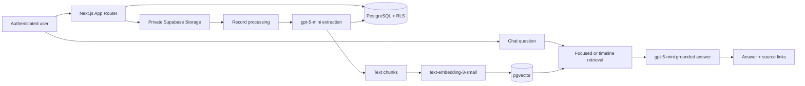

# Elderly Medical Assistant

Elderly Medical Assistant is an accessible web application for organizing personal medical records, understanding documented health history, managing medication schedules, and asking questions about uploaded documents. Its AI features are grounded in each authenticated user's records and are designed to summarize—not diagnose or provide medical advice.

**Live Demo:** https://elderly-medical-assistant.vercel.app/

## Features

- Email/password authentication with confirmation, login, logout, and protected routes
- Private, user-scoped medical-record storage with Supabase Row Level Security (RLS)
- PDF, JPEG, PNG, and WebP uploads up to 10 MB with processing status feedback
- Structured AI extraction of document type, date, summary, conditions, medications, allergies, procedures, and medical events
- A patient-friendly Medical Overview generated from all successfully processed records
- Manual medication management with multiple schedule times, active date ranges, and Taken logging
- Reviewable medication suggestions from extracted records—never silently added to a schedule
- A dashboard showing today's medication doses, overview status, records, and latest update
- A retrieval-augmented chatbot grounded in the authenticated user's uploaded records
- Timeline-aware retrieval for history, trend, comparison, and first-mentioned questions
- Conversation-aware follow-ups that resolve references such as “it” or “that” before retrieving fresh evidence
- Human-readable source-record links without exposing internal record identifiers
- Responsive, accessibility-oriented layouts with readable text, strong contrast, and large controls

## How It Works

1. The user creates an account or signs in with Supabase Auth.
2. The user uploads a supported PDF or image to the private `medical-records` bucket.
3. Supabase Storage and database policies scope the file and record to that user.
4. A protected server route sends the document to `gpt-5-mini` for structured extraction.
5. The extracted data and processing status are saved with the medical record.
6. The user's Medical Overview is regenerated from all successfully processed record data.
7. Useful record content is split into text chunks.
8. `text-embedding-3-small` creates embeddings stored in PostgreSQL with pgvector.
9. Chat questions retrieve relevant user-owned chunks through focused or timeline-aware search.
10. `gpt-5-mini` receives retrieved medical-record evidence and produces a grounded, structured answer with supporting source links.

## RAG Architecture

Record chunks use `text-embedding-3-small` embeddings with 1,536 dimensions and are stored in the `document_chunks` table as pgvector values. Retrieval functions run as `security invoker`, filter by `auth.uid()`, and work alongside table-level RLS.

Ordinary questions use a focused semantic search. Timeline and comparison questions use broader retrieval, limit how many chunks one record can contribute, favor coverage across distinct records, and order dated context chronologically when dates are available.

For an ambiguous follow-up, the application sends only the recent conversation needed to rewrite it as a standalone retrieval question. The prior response helps resolve the topic but is not treated as medical evidence. The answer model returns structured attribution data for source links, while patient-visible text is sanitized so internal identifiers remain hidden.



## Security and Privacy

- Supabase Auth manages sessions through SSR-compatible browser and server clients.
- `/dashboard`, `/records`, `/overview`, `/medications`, and `/chat` require authentication.
- RLS scopes records, overviews, medications, schedules, logs, and document chunks to `auth.uid()`.
- Private Storage policies require each object path to begin with the authenticated user's ID.
- Record viewing uses short-lived signed URLs after an authenticated, RLS-protected lookup.
- OpenAI calls and `OPENAI_API_KEY` access remain in server-only code.
- Browser code uses only the Supabase publishable key; no service-role key is used in the browser.
- Environment files are ignored by Git except for the safe `.env.example` template.

This project is **not HIPAA-certified** and does not claim production healthcare compliance. Handling protected health information in production would require separate legal, operational, infrastructure, privacy, and security reviews.

## Tech Stack

- **Next.js 16.3.2** with App Router, Route Handlers, Server Components, and proxy-based route protection
- **React 19.2.8**
- **TypeScript 5**
- **Supabase** with `@supabase/supabase-js` 2.x and `@supabase/ssr` 0.12.x
- **PostgreSQL**, Supabase Storage, RLS, and pgvector
- **OpenAI Node SDK 7.x**
- **`gpt-5-mini`** for extraction, overview generation, follow-up resolution, and grounded answers
- **`text-embedding-3-small`** for 1,536-dimensional embeddings
- **Tailwind CSS 4** and PostCSS
- **ESLint 9** with the Next.js configuration
- **Vercel** for deployment

## Project Structure

```text
src/
├── app/
│   ├── api/chat/                 # Authenticated RAG chat route
│   ├── api/records/[id]/process/ # Server-side extraction and indexing
│   ├── auth/                     # Authentication form and callback
│   ├── dashboard/                # Home dashboard and today's doses
│   ├── records/                  # Upload, list, view, and delete records
│   ├── overview/                 # Patient-facing medical overview
│   ├── medications/              # Medication and schedule management
│   └── chat/                     # Chat interface
├── lib/
│   ├── openai/                   # Model configuration, processing, and RAG
│   └── supabase/                 # Browser/server clients and shared data logic
└── proxy.ts                      # Session refresh and protected-route handling

supabase/migrations/              # Schema, RLS, Storage, and retrieval SQL
```

## Local Setup

### Prerequisites

- A Node.js version supported by Next.js 16
- npm
- A Supabase project
- An OpenAI API key

### Installation

1. Clone the repository and enter it:

   ```bash
   git clone <repository-url>
   cd elderly-medical-assistant
   ```

2. Install dependencies:

   ```bash
   npm install
   ```

3. Create `.env.local` using the variables below.

4. Enable email/password authentication in Supabase. If email confirmation is enabled, add the application's `/auth/callback` URL to the permitted Auth redirect URLs.

5. Apply all SQL migrations in chronological filename order.

6. Start the development server:

   ```bash
   npm run dev
   ```

## Environment Variables

Store real values in `.env.local` and in the deployment platform. Never commit secrets.

```dotenv
NEXT_PUBLIC_SUPABASE_URL=https://your-project-ref.supabase.co
NEXT_PUBLIC_SUPABASE_PUBLISHABLE_KEY=your-supabase-publishable-key

OPENAI_API_KEY=your-openai-api-key
OPENAI_MODEL=gpt-5-mini
OPENAI_EMBEDDING_MODEL=text-embedding-3-small
```

`OPENAI_MODEL` is validated by the application and must be `gpt-5-mini` unless the code is intentionally changed. The database schema expects 1,536-dimensional embeddings.

## Database Setup

Apply these migrations in order with the Supabase SQL Editor or a linked Supabase CLI workflow:

1. `20260822000000_create_medical_records.sql` — creates medical records, RLS, the private Storage bucket, upload restrictions, and user-folder policies.
2. `20260822010000_add_ai_medical_processing.sql` — adds processing and extracted-data fields plus user-scoped medical overviews.
3. `20260823000000_create_medication_schedule.sql` — creates medications, schedules, dose logs, ownership constraints, indexes, and RLS.
4. `20260823010000_create_document_chunks.sql` — enables pgvector, creates 1,536-dimensional document chunks, and adds focused semantic matching.
5. `20260823020000_add_timeline_chunk_search.sql` — adds timeline retrieval with dates and per-record chunk limits.
6. `20260823030000_prioritize_timeline_record_diversity.sql` — prioritizes coverage across records during timeline retrieval.

The first migration creates the private `medical-records` bucket automatically. The application does not require a service-role key.

## Deployment

**Production:** https://elderly-medical-assistant.vercel.app/

To deploy with Vercel:

1. Import the Git repository into Vercel.
2. Configure all variables from [Environment Variables](#environment-variables).
3. Confirm that the target Supabase project has every migration applied.
4. Add the deployed origin and `/auth/callback` URL to the permitted Supabase Auth URLs.
5. Deploy and test authentication, uploads, processing, medication logging, and chat.

After a repository is connected to Vercel, pushes to the branch configured as the production branch automatically trigger production deployments. Other branches can produce preview deployments according to the Vercel project settings.

## Testing and Validation

Run the available static checks:

```bash
npx tsc --noEmit
npm run lint
git diff --check
```

The repository does not currently include an automated test suite. Recommended manual validation:

- Create and confirm an account, then test login and logout.
- Upload a supported synthetic document and verify processing, viewing, and deletion.
- Confirm that the Medical Overview updates after processing.
- Add, edit, schedule, and delete a medication; mark a dose Taken from both medication and dashboard pages.
- Review an extracted medication suggestion and confirm that adding it requires user approval and explicit times.
- Ask focused and timeline questions, then test a referential follow-up such as “So is it getting better?”
- Check all protected pages at desktop and mobile widths.

## Example RAG Interaction

This example uses **synthetic demo data**, not personal medical information.

> **User:** How did my blood pressure change over time?
>
> **Assistant:** Your uploaded demo records document readings of 148/88 mmHg in April 2023, 150/86 mmHg in June 2024, 138/82 mmHg in January 2025, and 132/80 mmHg in March 2026. Supporting records are linked below the answer.
>
> **User:** So is it getting better?
>
> **Assistant:** Yes. The retrieved readings show an overall improving trend, moving from the high 140s/150 systolic range to 132/80 mmHg. This conclusion is grounded in newly retrieved record evidence, not the previous chatbot answer.

## Known Limitations

- AI extraction and summaries depend on document readability and may require review against the original record.
- Broad timeline retrieval is ranking-based and can occasionally omit a relevant record.
- Conversation context is intentionally limited; unresolved references require clarification.
- AI-extracted medication suggestions require user review and explicit schedule times.

## Disclaimer

Elderly Medical Assistant is an educational and personal record-management project. AI-generated extractions, summaries, overviews, and chatbot answers may be incomplete or incorrect and are not medical advice, diagnosis, or a substitute for professional care. Verify important information against the original records and consult a qualified healthcare professional for medical decisions.
